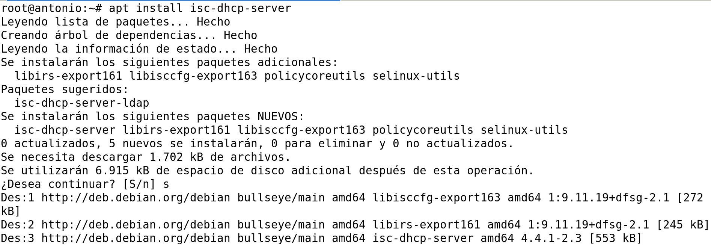
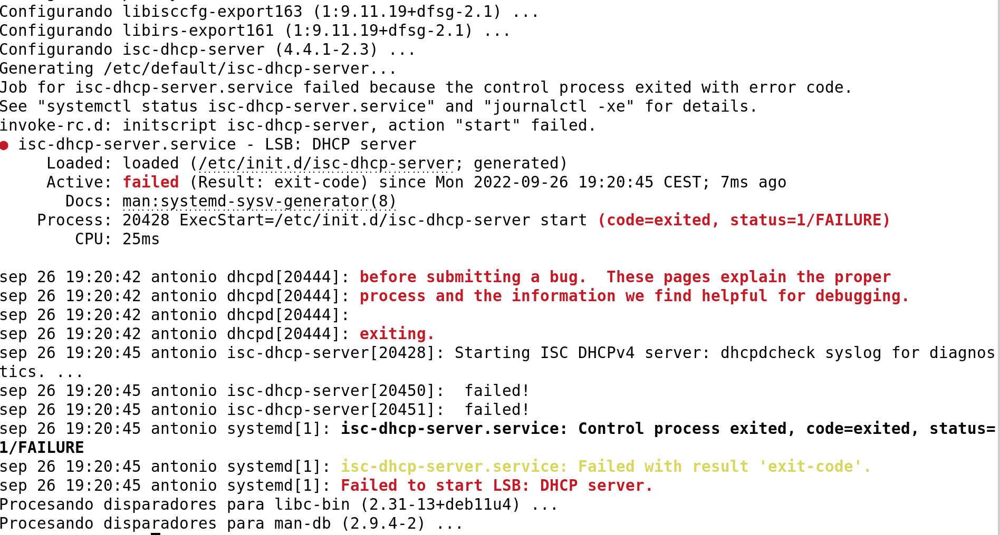
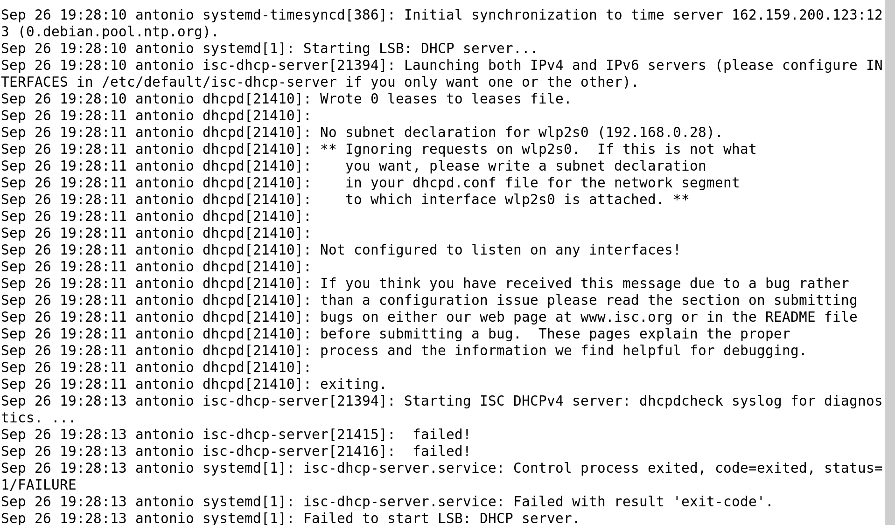

# Configuración DHCP en Debian

## Instalacion del Servidor

Para instalar el servidor en Debian, ejecutar el siguiente comando:

```bash
apt install isc-dhcp-server
```



Sale el siguiente error:



Parece que no se puede iniciar el servicio porque hay que configurarlo.

Para obtener mas detalles sobre el error, se puede consultar el log del systema con:

```bash
cat /var/log/syslog | grep "dhcp"
```



### Referencias

* [Blog Jesus](https://jesusfernandeztoledo.com/configurar-servidor-dhcp-en-debian-ubuntu/)