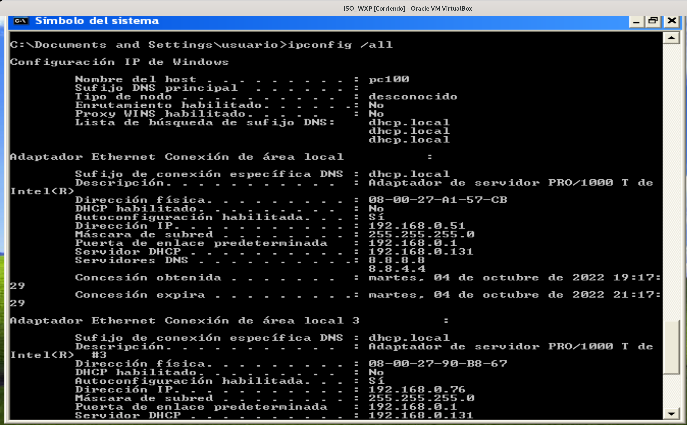
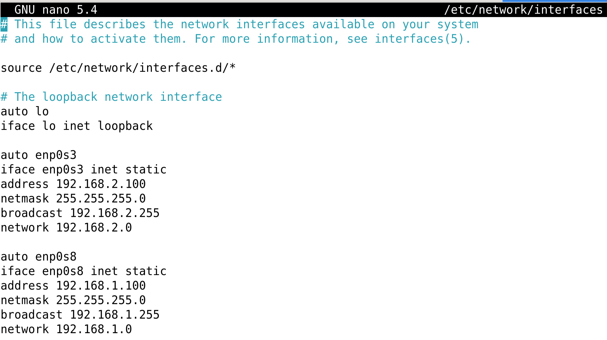
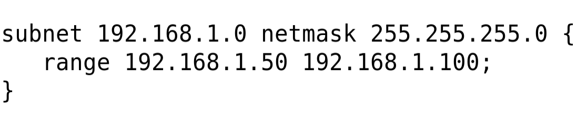
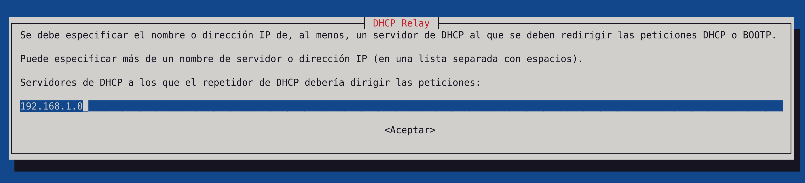
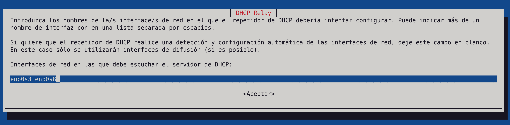
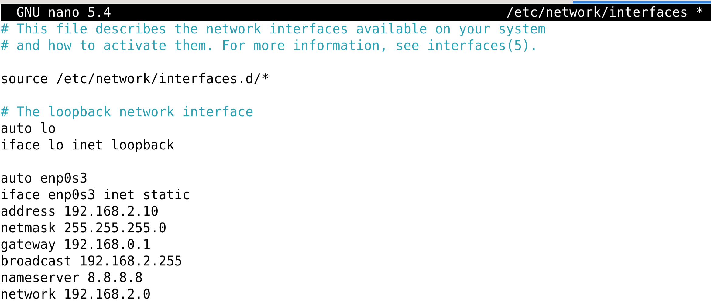
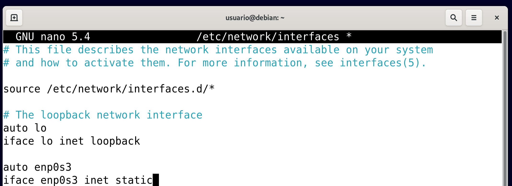
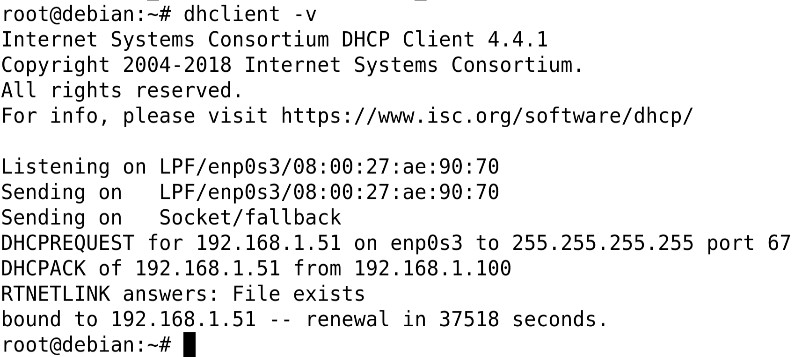

# Tarea 1. Fecha: 18/10/2022

# Información sobre MV y versión de SO
## Debian


## VirtualBox


# Configuración DHCP en Debian

## Instalacion del Servidor

Para instalar el servidor en Debian, ejecutar el siguiente comando:

```bash
apt install isc-dhcp-server
```


Sale el siguiente error:


Parece que no se puede iniciar el servicio porque hay que configurarlo.

Para obtener mas detalles sobre el error, se puede consultar el log del systema con:

```bash
cat /var/log/syslog | grep "dhcp"
```


## Configuracion

Para empezar a configurar, ponemos nuestra IP de manera estatica modificando el siguiente fichero:

```bash
nano /etc/network/interfaces
```


A continuacion, modificamos el archivo de configuracion de isc-dhcp-server


```bash
nano nano /etc/default/isc-dhcp-server
```

Descomentamos todas las lineas relacionadas con v4, le anadimos a uno de los interfaces del final v4 y terminamos anadiendole el nombre de nuestra tarjeta de red y guardamos.


A continuacion, modificamos el archivo de configuracion del servidor DHCP, aunque antes haremos una copia de seguridad por si algo sale mal:

```bash
cp /etc/dhcp/dhcpd.conf /etc/dhcp/dhcpd.conf.ORIGINAL
```

```bash
nano /etc/dhcp/dhcpd.conf
```

Aqui configuraremos todo lo descomentado, recordando que el rango de IPs que vayas a elegir pertenezcan a tu red.


Finalmente reiniciamos el servidor para confirmar los cambios

```bash
systemctl restart isc-dhcp-server
```

## Comprobacion

Para poder comprobar la configuracion del servidor DHCP, necesitamos un cliente que se conecte a el. Entonces, veremos si el servidor le asigna una IP automaticamente al cliente.

Para ello, vamos a ejecutar una maquina virtual con Windows XP.

> Nota: La instalacion y configuracion del servidor DHCP se ha realizado en una maquina virtual con Debian.

> Nota: Si vemos un error parecido al siguiente, significa que falta un punto y coma (semicolon) en la línea indicada.
```
Oct  2 18:53:18 debian isc-dhcp-server[25084]: /etc/dhcp/dhcpd.conf line 10: semicolon expected.
```

En Virtual Box, se configuran las tarjetas de red de ambas maquinas como redes internas y en Avanzado, le damos a permitir todo.


Iniciamos la maquina de Debian y miramos el log del sistema con

```bash
tail -f /var/log/syslog
```

Iniciamos la maquina de Windows XP y vemos que el servidor le asigna una IP del rango automaticamente.


En el log de Debian podemos ver lo siguiente:


# Configuración DHCP en Debian con dos tarjetas y dos subredes.

## Configuracion

Para cofigurarlo, primero le damos una ip estatica a la nueva tarjeta de red del servidor desde 

```bash
nano /etc/network/interfaces
```


Despues añadimos el nombre de la segunda tarjeta de red al archivo de configuracion

```bash
nano nano /etc/default/isc-dhcp-server
```


Luego accedemos al archivo de configuracion

```bash
nano /etc/dhcp/dhcpd.conf
```

y añadimos una nueva subred distinta a la anterior


A continuacion, reiniciamos

```bash
systemctl restart isc-dhcp-server
```

## Comprobacion

Para comprobarlo, creamos una nueva tarjeta de red en la maquina cliente con la opcion "red interna".
Le adjudicamos un nombre de adaptador de red que concida con el nombrado en uno de los adaptadores de red del servidor, y a continuacion iniciamos la maquina.

Veremos que el log del servidor recogerá como el servidor dhcp adjudica las ip a las tarjetas de red de la maquina cliente


Finalmente, visualizamos que las tarjertas de red de la maquina cliente han reciido las ip de las dos subredes definidas.


## Información sobre Red Interna, Red NAT y sus diferencias.

La red interna es un modo de configuración que nos permite crear una red local de dos o más máquinas virtuales, donde dos o más VM que tengamos configuradas se puedan comunicar entre sí sin problemas.


Una red NAT es una red que creará VirtualBox que permite compartir dicha red con varias máquinas virtuales de este sistema anfitrión. Además, proporciona una puerta de enlace con salida a Internet en la dirección de host número 1 de la red.

Diferencias entre las dos redes:
- La red interna solo permite ver maquinas virtuales que hemos se conectan a ella.
- La red interna la utilizaremos cuando deseemos que las maquinas este aisladas.
- La red interna no tiene DHCP, asi que la configuración en las maquinas deberá de ser manual o una de ellas comportarse como DHCP.
- La red NAT permite varias maquinas en la misma red. 
- La red NAT conserva los esquemas y rangos de direccionamiento.
- La red NAT conserva las direcciones a través de la multiplexación de aplicaciones a nivel de puertos.
- La red NAT aumenta la flexibilidad de las conexiones a las redes públicas.
- La red NAT permite ocultar las direcciones IPv4 privadas de los usuarios y otros dispositivos.


# Configuración de una ip fija a traves de una MAC.

## Configuracion

En la maquina cliente añadimos una nueva tarjeta de red (de manera red interna), preguntamos por la ip en el cmd, y copiamos la MAC de esa nueva tarjeta de red.

Despues, en el servidor, modificamos el archivo de configuracion

```bash
nano /etc/dhcp/dhcpd.conf
```

Aqui, modificamos la parte indicada en la captura siguiente, dandole un nombre al host para distinguir a qué le vas a dar esa ip fija, y pegamos la MAC copiada anteriormente en el lugar indicado.


Reiniciamos

```bash
systemctl restart isc-dhcp-server
```

Miramos el log del servidor y vemos que se adjudica la ip a la MAC indicada.


Finalmente, volvemos a la maquina cliente, y vemos que esa nueva tarjeta de red ha obtenido la ip fija a traves de su MAC.


# Configuración de FAILOVER
FAILOVER es una funcionalidad para configurar más de un servidor DNS. Si uno falla, otros responden.
Todos tienen que pertenecer a la misma red, así que para la práctica usaremos **una única tarjeta de red** en cada servidor DHCP (máquina debian) y configuramos las IPs para que sean de la misma red.

## Configuración de la máquina primaria
Dejamos una sola tarjeta de red en debian con la IP `192.168.0.31`. Modificamos el archivo dhcpd.conf de la siguiente manera:

```bash
authoritative; # Descomentamos esta línea

# Declarar failover
failover peer "FAILOVER" {
  primary;
  address 192.168.0.31; # Esta IP es la del servidor primario
  port 647;
  peer address 192.168.0.131; # Esta IP es la del servidor secundario
  peer port 647;
  max-unacked-updates 10;
  max-response-delay 30;
  load balance max seconds 3;
  mclt 1800;
  split 128;
}

# Modificamos la configuración de subred y metemos el rango
# de IPs en un pool.
subnet 192.168.0.0 netmask 255.255.255.0 {
#   range 192.168.0.50 192.168.0.100;
  option broadcast-address 192.168.0.255;
  option routers 192.168.0.1;
  option domain-name-servers 8.8.8.8, 8.8.4.4;
  pool {
    failover peer "FAILOVER";
    max-lease-time 3600;
    range 192.168.0.50 192.168.0.100;
  }
}

```

## Configuración de la máquina secundaria
Dejamos una sola tarjeta de red en debian con la IP `192.168.0.131`. Modificamos el archivo dhcpd.conf de la siguiente manera:

```bash
authoritative; # Descomentamos esta línea

# Declarar failover
failover peer "FAILOVER" {
  secondary;
  address 192.168.0.131; # Esta IP es la del servidor secundario
  port 647;
  peer address 192.168.0.31; # Esta IP es la del servidor primario
  peer port 647;
  max-unacked-updates 10;
  max-response-delay 30;
  load balance max seconds 3;
  mclt 1800;
  split 128;
}

# Modificamos la configuración de subred y metemos el rango
# de IPs en un pool.
subnet 192.168.0.0 netmask 255.255.255.0 {
#   range 192.168.0.50 192.168.0.100;
  option broadcast-address 192.168.0.255;
  option routers 192.168.0.1;
  option domain-name-servers 8.8.8.8, 8.8.4.4;
  pool {
    failover peer "FAILOVER";
    max-lease-time 3600;
    range 192.168.0.50 192.168.0.100;
  }
}

```

Reiniciamos el servicio `isc-dhcp-server.service` en ambas máquinas.
```bash
systemctl restart isc-dhcp-server.service
```

## Comprobación con máquina cliente (Windows XP)
Iniciamos la máquina cliente y vemos que los servidores DHCP le dan IPs del rango.
Si ejecutamos un `ipconfig /all`, podemos ver desde qué servidor DHCP se ha establecido la IP.

Para comprobar que la configuración del FAILOVER funciona, vamos a parar un servicio DHCP en una de las máquinas debian, por ejemplo en la `192.168.0.31`
```bash
systemctl stop isc-dhcp-server.service
```

Ahora, para renovar las IPs dadas por DHCP en Windows, abrimos una CMD y hacemos
```
ipconfig /release
ipconfig /renew
```

> Nota: Se hace antes un release para poner todas las IPs a cero. Luego un renew para que se aplique la configuración DHCP de nuevo.

Si volvemos a hacer un `ipconfig /all`, deberíamos ver que todas las IPs asignadas han sido mediante la máquina `192.168.0.131`.



# Configuración de servidor relay

## Configuración de las máquinas

Lo primero que hacemos es configurar crear 3 máquinas virtuales. Una con una tarjeta de red que hará de servidor, otra como cliente con una tarjeta de red, y otra que hará como servidor relay que contendrá 2 tarjetas de red.
Todo funcionará mediante un red interna.

Configuramos la máquina relay y le adjudicamos un rango de ip de la red del cliente, así, cuando la maquina cliente pida su ip, ésta podrá proporcionarsela.





> Nota: comentamos todo excepto el rango de ips a proporcionar en el archivo de configuracion del servidor DHCP.

Para terminar con la máquina relay, instalamos el servidor relay
```bash
apt install isc-dhcp-relay
```
Lo configuramos, primero, indicándole la network de la máquina cliente



Y después indicamos los nombres de las tarjetas de red



Configuramos la máquina servidor



Y hacemos lo mismo con la máquina cliente

st


## Comprobación del servidor relay

En la máquina servidor indicamos la ruta a añadir (network cliente) como la puerta por donde va a salir

```bash
ip route add 192.168.1.0/24 via 192.168.2.100
```

En la máquina cliente pedimos una ip, y vemos que ha recibido una ip dentro del rango de ips asignado en el servidor a través del servidor relay





## Referencias

* [Blog Jesus](https://jesusfernandeztoledo.com/configurar-servidor-dhcp-en-debian-ubuntu/)
* [IES Mar de Cadiz](https://www.fpgenred.es/DHCP/index.html)
* [DANITIC](https://danitic.wordpress.com/2018/10/24/diferencias-entre-nat-red-nat-adaptador-puente-internal-y-solo-anfitrion-en-virtualbox/)
* [REDESZONE](https://www.redeszone.net/tutoriales/servidores/configurar-linux-comando-ip-iproute2-suite/)
